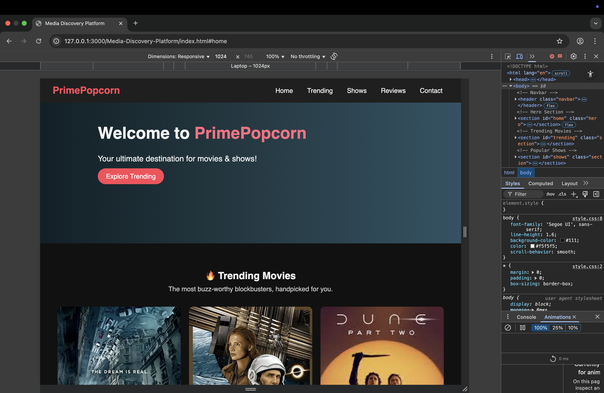
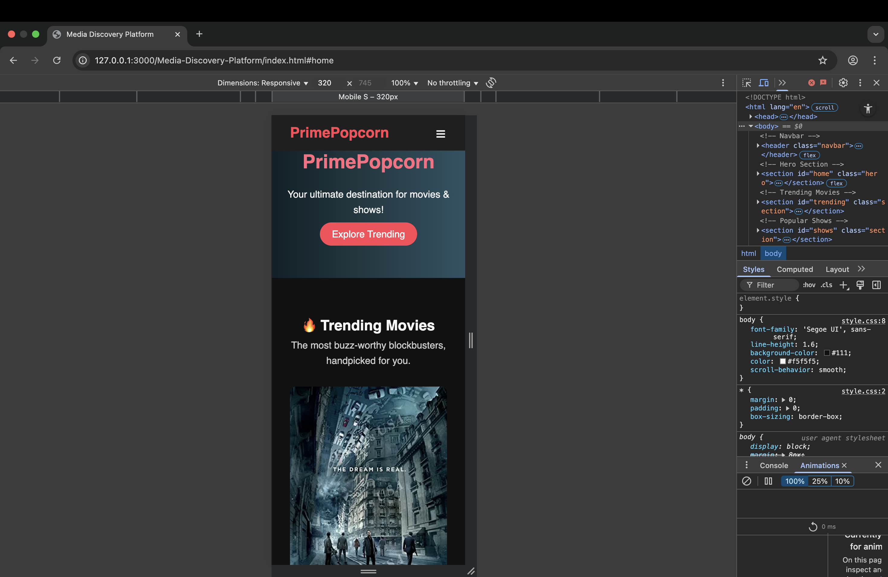
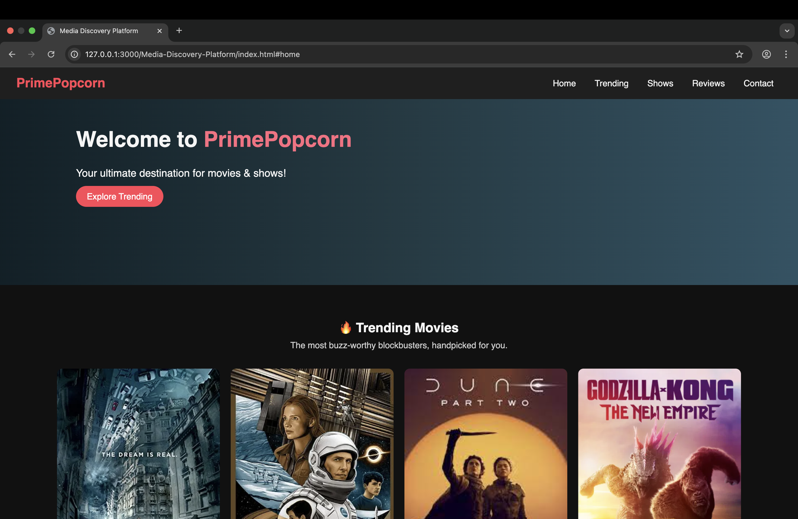

# Media-Discovery-Platform
# 🎬 Movies at one place

A fully responsive and stylish **Movie Library Website** built using **HTML and CSS only** – no JavaScript. This project showcases your front-end development skills by implementing interactive and responsive features like modals, theme switching, and a hamburger menu with pure CSS.

---

## 🌟 Features

- ✅ **Fixed Navigation Bar**
  - Logo + smooth scroll links
  - Responsive hamburger menu (CSS-only)

- ✅ **Hero Section**
  - Flexbox layout
  - Animated SVG on the right
  - Movie library name, catchy subtitle, and scroll button on the left

- ✅ **Trending Movies**
  - 4–5 movie cards with:
    - Image
    - Title & description
    - Duration (bottom-right corner)
    - On hover: “Watch Now” + Add to Watchlist (+ / ✓ toggle using only CSS)

- ✅ **Popular Shows**
  - Similar to movies with:
    - Cover image, genre, seasons, synopsis
    - “Learn More” CSS-only modal with detailed info and “Watch Now” button

- ✅ **User Reviews**
  - Review cards with user photo, name, and comment
  - Submit review form with styled inputs

- ✅ **Footer**
  - Social media icons with hover effects
  - External links (Terms, Privacy Policy) that open in new tabs

- 🌓 **Bonus: Light/Dark Mode**
  - CSS-only theme switch using checkbox and `:has()`

- 📱 **Fully Responsive**
  - Optimized for all screen sizes using CSS media queries

---

## 📂 Folder Structure
├── 📄 index.html
├── 📄 style.css
└── 📁 assets/
├── 🎞️ images/
└── 💠 svg/

 ---

## 🛠️ Tech Stack

- **HTML5**
- **CSS3**
- **Responsive Design (Media Queries)**
- **Pure CSS Interactivity (No JavaScript)**

---

## 🚀 Getting Started
## 📸 Screenshots

### 💻Laptop view

### 📱 Mobile View

### Normal view

🙌 Acknowledgements
	•	Movie covers used from IMDb
	•	Social icons from Font Awesome
	•	SVGs used from unDraw